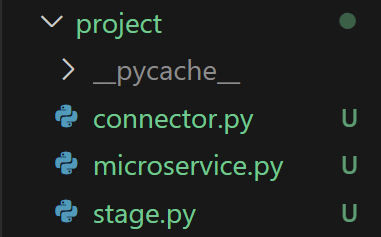

# Microservice - Python
Proyecto base para crear microservicios de integración a
bases de datos Mysql con Python.

## Documentación técnica

### Configuración del entorno de desarrollo.
| Paso   | Descripción                       | comando                             |
| :----  | :----                             | :---                                |
| Paso 1 |  Crear el entorno de trabajo.     | python -m venv env                  |
| Paso 2 | Activar el entorno de trabajo.    | ./env/Scripts/activate              |
| Paso 3 | Actualizar el gestor de paquetes. | python -m pip install --upgrade pip |
| Paso 4 | Prepare la receta de librerías.   | pip install -r requirements.txt     |

### Librerías del proyecto.
| librería | Descripción | Comando |
| :----    | :---        | :---    |
| mysql-connector | Permite el acceso a una base de datos mysql | python -m pip install mysql-connector |


## Arquitectura del proyecto

En la carpeta "core" está el corazón de la simplificación de procesos 
de integración que facilitan un desarrollo ágil, es código que generalmente
se necesita para este tipo de desarrollos y no debería haber ninguna modificación
a lo largo de la vida útil del microservicio, salvo que el interés de tal
acción sea optimizar o agregar un proceso aplicable a nivel general de todos los microservicios que usen esta arquitectura en su organización.

En la carpeta "project" se debe desarrollar la lógica del
microservicio.



### Demo
Por seguridad informática se debe establecer las credenciales de forma secreta.

```python

import mysql.connector
    
class Connector:

    def __init__(self):
       self.__host=""
       self.__user=""
       self.__password=""
       self.last_insert_id=""

    def __secret(self):
       self.__host="localhost"
       self.__user="root"
       self.__password=""

    def connectorServer(self):
        self.__secret()
        ...

```

## Carpeta Project
En la carpeta project se debe configurar la lógica del desarrollo de cada microservicio.   
## Archivo main.py
El proyecto se ha configurado de manera simulativa a partir
de un ejemplo de integración a bases de datos relacionales,
donde se recibe la información encapsulada en formato json.
Los datos de entrada deben ser modificados de acuerdo al proyecto, en esta primera entrega están presentes en main.py

### Realice sus pruebas, actualizaciones o modificaciones.
Puedes actualizar, contribuir y mejorar el presente software, es libre. Licencia GNU v3. No esta permitido modificar la licencia de trabajos derivados de este proyecto. Por norma internacional debes conservar el mismo tipo de licencia.

#### Actualizar la receta.
Si agregas nuevas librerías al proyecto, no olvides actualizar la receta.

``` CMD
pip freeze > requirements.txt
```

---

#### Comprobar que todo está en orden.
| Paso   | Descripción                                   | comando                               |
| :----  | :----                                         | :---                                  |
| Paso 1 | Desactive el entorno de trabajo.              | deactivate                            |
| Paso 2 | Elimine el entorno anterior.                  | rm -R env                             |
| Paso 3 | Cree un entorno de python.                    | python -m venv env                    |
| Paso 4 | Active el entorno de trabajo.                 | ./env/Scripts/activate                |
| Paso 5 | Actualice el gestor de paquetes.              | python -m pip install --upgrade pip   |
| Paso 6 | Instale las librerías necesarias para operar. | pip install -r requirements.txt       |
| Paso 7 | Realice pruebas de rutina.                    | py main.py |
| Paso 8 | Finalice su gestión.                          | deactivate                            |

